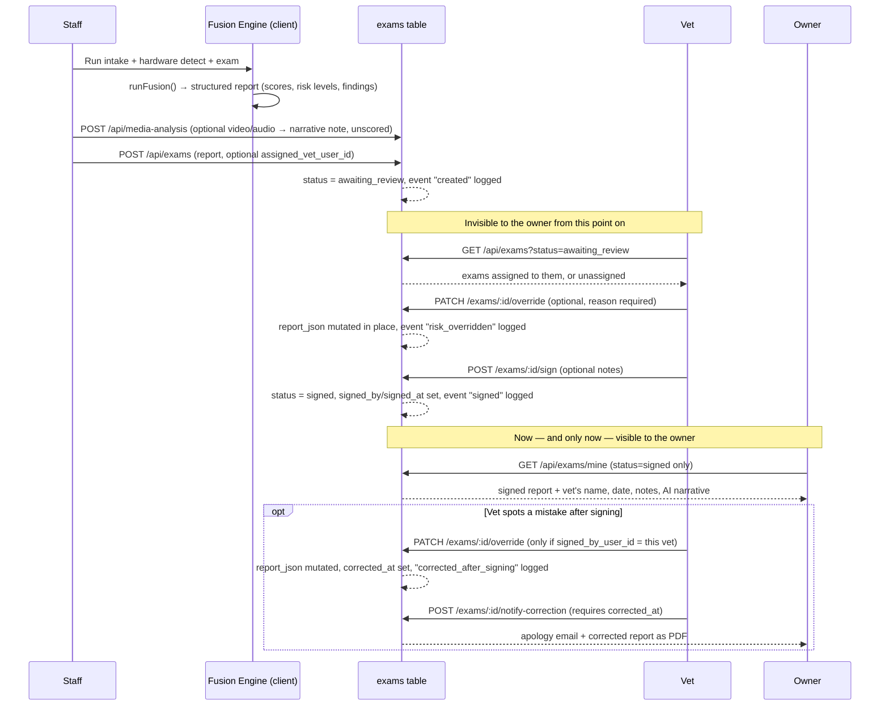

# Vitarus — User Roles & Report Lifecycle

Reference doc for what each account type can do, how a report moves from
"exam just ran" to "owner can see it," and how appointment requests travel the
other way from owner to clinic. Every rule below is enforced server-side
(role + status checks in `server/lib/*.js`) — UI hiding is cosmetic only,
never the actual gate.

---

## 1. Roles at a glance

| Role | Belongs to a lab? | Interface | Demo login |
|---|---|---|---|
| Public / prospect | — | `index.html` | — |
| Pet owner | No (patient-side, not clinic-side) | `owner/index.html` | Register at `login.html` |
| Staff | Yes, exactly one | `staff/index.html` | `staff@vitarus.demo` |
| Vet (doctor) | Yes, exactly one | `vet/index.html` | `vet@vitarus.demo` |
| Admin | Yes, exactly one (manages it) | `admin/index.html` | `admin@vitarus.demo` |
| Super admin | No (oversees every lab) | `admin/index.html` (Labs + Super Admin tabs) | `superadmin@vitarus.demo` |

All clinic-side demo passwords are `demo1234`.

---

## 2. What each role can do

### Public / prospect
- Sees the landing page only. No data access. Links to sign in or register.

### Pet owner
- Self-registers (name/email/password) — role is hardcoded server-side, never client-supplied.
- Sees only pets linked to their account (by `owner_user_id`, or auto-linked by email the moment they register if staff already entered that pet).
- Can add a pet themselves.
- Sees each pet's full profile: species/breed/sex/age/weight/microchip/date added.
- Sees **signed reports only** — an exam that's still `awaiting_review` never appears here, full stop.
- Opens a signed report read-only, with the reviewing vet's name, sign-off date, notes, and the AI narrative.
- Can compare any two signed reports for the same pet (score delta, per-system risk-level deltas).
- Can edit their own profile (name, phone, address).
- **Can request an appointment**: picks a clinic, optionally one of their own pets, a date and a
  time, plus an optional reason. Sees every request they've made with its current status.
- Cannot see other owners, cannot see unsigned exams, cannot override or annotate anything.

The owner portal is organised into three sections behind one tab bar — **My Pets**,
**Appointments**, **My Profile** — with live counts on the tabs (pets held, appointment requests
still pending). Everything used to sit on a single scrolling page; the three concerns are the same,
only the navigation changed.

### Staff
- Belongs to one lab; created by an admin/super admin (or seeded).
- Runs the exam wizard: **Patient Intake → Hardware Detection → Run Exam → Review & Submit**.
- Creates or searches for a patient record; captures microchip/weight/body-condition photo at intake.
- Runs the full simulated instrument suite; the client-side fusion engine turns all six modules' output into one structured report (per-system risk level, confidence, findings, evidence, overall health score, recommendations).
- **Can attach video or audio** to the exam — a clip of the pet's gait, auscultation audio, an owner
  describing symptoms. It's analysed server-side (`server/lib/media-analysis.js`: Whisper for audio,
  ffmpeg frame extraction for video) into a plain-text clinical observation shown at Review.
  This is **narrative supporting evidence for the vet, deliberately not scored** — it never enters
  the fusion engine's risk model or the health score.
- On submit, can **name a specific vet** to route the report to (dropdown scoped to their own lab's vets) — or leave it unassigned for any vet in the lab to pick up.
- Sees "My Submitted Exams" — status of what they personally submitted.
- **Patient Records**: look up *any* patient (not just their own submissions) and see the owner's contact info (name/email/phone/address, or "not yet registered" + intake email) plus that pet's full report history, any status, read-only.
- **Appointment requests**: sees the pending requests for their own lab and can **accept** one
  (which locks that clinic/date/time slot) or **decline** it with a reason.
- Cannot review, override, or sign anything — submission is a one-way handoff to the vet.
- Can optionally sign in with "preview the Owner Portal" checked, to see the owner-side UI for demo/QA purposes.

### Vet (doctor)
- Belongs to one lab; created by an admin/super admin (or seeded).
- **Pending Review queue**: exams with `status=awaiting_review` that are either assigned to them by name or left unassigned (open pool). Exams routed to a different vet don't show up.
- Opens an exam and can:
  - **Override** any system's risk level — a written reason is required, and it's logged as an audit event with the previous level, new level, reason, and timestamp.
  - Add free-text notes.
  - **Sign & Release** — the one-way action that flips status to `signed` and makes the report
    visible to the owner for the first time.
- **Can correct their own signed report.** Signing is no longer absolutely final: the vet **who
  signed** a report may reopen it and override a risk level after the fact, because a mistake
  spotted once the report has already reached the owner shouldn't be permanently frozen. The
  correction is logged distinctly as `corrected_after_signing` and stamps `corrected_at`. Any
  *other* vet still gets `409 exam is already signed and frozen`.
  - Having made at least one correction, the signing vet can then send the owner a
    **correction notice** — an apology email carrying the corrected report as a PDF. It's refused
    if nothing was actually changed, and only the signing vet may send it.
  - There is still **no un-signing**: a report cannot return to `awaiting_review`.
- **Appointment requests**: sees pending requests for their lab, and can accept or decline them.
- **Patient History** tab: every patient with ≥1 signed exam; opening one shows *all* their exams (any status, unlike the owner's signed-only view), owner contact info, and side-by-side comparison of any two reports.
- Can edit their own profile (name, phone, specialty, clinic name).
- Cannot create labs or accounts, cannot see exams that were never routed to them or left unassigned.

### Admin
- Manages exactly **one** lab (set at account creation, reassignable only by a super admin).
- **Overview**: live platform stats — pet/exam counts, awaiting/signed counts, average health score, accounts by role, recent activity.
- **My Lab**: edit their lab's name/address; see its staff roster and assigned doctors; manage its machine roster (add/remove machines, set state to operational/maintenance/offline).
- **All Users** / **All Exams**: full visibility platform-wide (these two tabs are not lab-scoped — an admin sees every user except owners, and every exam, regardless of lab).
- **Clinic Accounts**: create vet/staff accounts — new accounts are automatically placed in the
  admin's own lab — and **edit or delete existing ones**, with search by name/email and filtering.
  A super admin additionally sees a lab column and can assign an account to any lab.
- **Appointment requests**: sees pending requests for their lab, and can accept or decline them.
- Can open any exam's patient record to see owner contact info + that pet's full history.
- Cannot create labs, cannot create other admins, cannot reassign anyone's role or lab.

### Super admin
- Everything admin can do, plus:
- **Labs** tab: create new labs, browse every lab platform-wide, open any lab (not just one) to manage its staff, doctors, and machines.
- Can create **admin** accounts in addition to vet/staff, and assign any new account to any lab via a lab picker.
- **Super Admin** tab: reassign any user's role and/or lab — immediate, no undo.
- Sees every user including pet owners (admin's user list excludes owners).
- Isn't tied to a lab themselves — they oversee all of them.

---

## 3. The report lifecycle: creation → verification → release

**Step by step:**

1. **Creation (staff).** Patient intake → hardware detection → run exam. Each
   simulated instrument module produces its own AI analysis; the client-side
   fusion engine (`js/fusion-engine.js`) combines all six into one structured
   report: per-system risk level, confidence, key findings, supporting
   evidence, an overall health score, and recommendations.
2. **Submission.** Staff reviews the AI-generated preview, optionally picks a
   specific vet to send it to, and submits. `POST /api/exams` stores the
   report as `status = 'awaiting_review'` and logs a `created` audit event.
   **Nothing here is visible to the owner** — that's enforced server-side by
   the `/exams/mine` query only ever selecting `status = 'signed'`.
3. **Routing.** If staff named a vet, the exam appears only in that vet's
   queue (plus their view of the general unassigned pool). Left unassigned,
   any vet in the lab can pick it up.
4. **Verification (vet).** While the exam is `awaiting_review`, the vet opens it and sees the same rendered
   report staff saw. They may override any system's risk level — a reason is
   mandatory, and the override is logged as an audit event capturing the
   previous level, new level, who made the change, and when. Overrides
   mutate the stored report in place, so the owner later sees the corrected
   version, not the original.
5. **Sign & release.** This is the gate: `POST /exams/:id/sign` sets
   `status = 'signed'`, records the signing vet and timestamp, saves any
   notes, and logs a `signed` event. The report becomes visible to the owner
   at this moment and not before.
6. **Release (owner).** The report now appears in the owner's portal exactly
   as the vet left it, with a "Signed by Dr. X on [date]" banner and their
   notes. The owner can compare it against any other signed report for the
   same pet.
7. **Correction after signing (vet who signed only).** Signing freezes the
   report against *everyone else*, but not against its own author. The
   signing vet may reopen it and override a risk level — `PATCH
   /exams/:id/override` accepts a signed exam only when
   `signed_by_user_id = req.user.id`, and every other case still returns
   `409 exam is already signed and frozen`. That path logs
   `corrected_after_signing` rather than `risk_overridden` and stamps
   `corrected_at`, so the two are distinguishable forever in the audit trail.
   `POST /exams/:id/notify-correction` then emails the owner an apology with
   the corrected report attached as a PDF; it's refused unless a correction
   was actually made (`corrected_at` set). Overrides mutate the stored report
   in place, so the owner's portal shows the corrected version, not the
   original. A report still cannot be **un-signed**.
8. **Nothing is ever deleted.** Every exam — awaiting review or signed —
   stays in the `exams` table permanently, so "previous reports" persist
   indefinitely. Staff, admin, and super admin can pull a patient's full
   history (any status) at any time via Patient Records / All Exams. The
   `exam_events` table is the full audit trail: every creation, override, and
   signature, in order, with who did it and why.

---

## 4. Appointment requests

A separate, much smaller flow that runs alongside the report lifecycle and shares none of its
machinery. Deliberately a **request/accept exchange, not a computed-availability calendar**: the
owner proposes a time, the clinic either takes it or doesn't.

| Step | Who | What happens |
|---|---|---|
| Request | Owner | `POST /api/appointments` with a clinic, an optional pet of their own, a date (`YYYY-MM-DD`), a time (`HH:MM`) and an optional reason. Past date/times are rejected. Status starts `pending`. |
| Notify | — | Every **staff, vet and admin at that lab** is emailed and sees the request in their portal. Super admins are platform-wide, so they're deliberately left off a single lab's inbox — though they can still act on the request. |
| Accept | Staff / vet / admin | `POST /api/appointments/:id/accept` sets `accepted`, records who handled it and when, and **locks that clinic/date/time slot**. The owner gets a confirmation email. |
| Decline | Staff / vet / admin | `POST /api/appointments/:id/decline` sets `declined` with a reason, and emails the owner, so they aren't left waiting. Declining locks nothing. |

**The slot lock is a database guarantee, not a UI one.** A partial unique index —
`UNIQUE (lab_id, requested_date, requested_time) WHERE status = 'accepted'` in `server/db.js` — is
what actually prevents two staff accepting the same slot; `appointments-api.js` also pre-checks so
the loser sees a readable "that slot was already booked" instead of a raw constraint violation.
Because the index is partial, declined and pending rows are excluded, so a clinic can hold many
requests for one slot and accept exactly one.

Requests are lab-scoped: a clinic user acting on a request for a lab that isn't theirs gets `403`,
and acting on one that isn't still `pending` gets `409`.

Statuses are `pending → accepted | declined`. A fourth, `cancelled`, exists in the schema's `CHECK`
constraint and has an owner-portal label, but no endpoint sets it yet — it is reserved, not
reachable.

---

## 5. Interfaces

Each role has its own page, and all four signed-in portals share one set of furniture from
`css/shared.css` (header, tab bar, cards, tables).

- **Owner** (`owner/index.html`) — three sections behind a tab bar: **My Pets**, **Appointments**,
  **My Profile**, with live counts on the tabs. Opening a pet's report and coming back returns you
  to the section you left.
- **Staff** (`staff/index.html`) — the four-step exam wizard, plus Patient Records and the lab's
  pending appointment requests.
- **Vet** (`vet/index.html`) — Pending Review, Patient History, My Profile.
- **Admin / super admin** (`admin/index.html`) — Overview, My Lab (Labs for a super admin), All
  Users, All Exams, Clinic Accounts, and the Super Admin tab.

All of them are usable on a phone: the portals are verified free of horizontal overflow from 320px
up, tab bars scroll horizontally rather than hiding tabs that don't fit, wide tables scroll inside
their own card, and touch targets are at least 44px.

---

## 6. The core rule

> No clinical content reaches an owner without a registered vet's sign-off.

Everything above exists to enforce that one sentence — the `status` column
on `exams` is the single source of truth, and every query that touches it
from the owner's side filters on `status = 'signed'` at the database level,
not in the UI.
