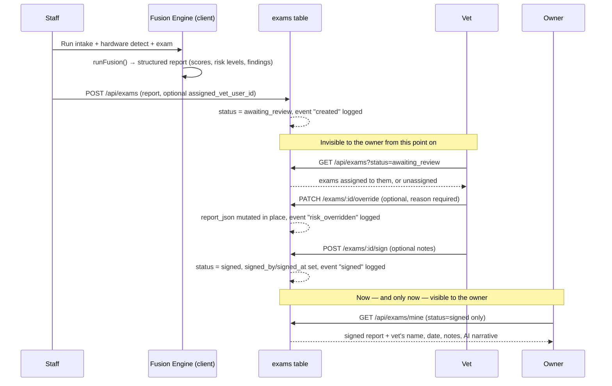

# Vitarus — User Roles & Report Lifecycle

Reference doc for what each account type can do, and how a report moves from
"exam just ran" to "owner can see it." Every rule below is enforced
server-side (role + status checks in `server/lib/*.js`) — UI hiding is
cosmetic only, never the actual gate.

---

## 1. Roles at a glance

| Role | Belongs to a lab? | Interface | Demo login |
|---|---|---|---|
| Public / prospect | — | `index.html` | — |
| Pet owner | No (patient-side, not clinic-side) | `owner/index.html` | Register at `login.html` |
| Staff | Yes, exactly one | `staff/index.html` | `staff@vitarus.demo` |
| Vet (doctor) | Yes, exactly one | `vet/index.html` | `vet@vitarus.demo` |
| Admin | Yes, exactly one (manages it) | `admin/index.html` | `admin@vitarus.demo` |
| Super admin | No (oversees every lab) | `admin/index.html` (Labs + Super Admin tabs) | `superadmin@vitarus.demo` |

All clinic-side demo passwords are `demo1234`.

---

## 2. What each role can do

### Public / prospect
- Sees the landing page only. No data access. Links to sign in or register.

### Pet owner
- Self-registers (name/email/password) — role is hardcoded server-side, never client-supplied.
- Sees only pets linked to their account (by `owner_user_id`, or auto-linked by email the moment they register if staff already entered that pet).
- Can add a pet themselves.
- Sees each pet's full profile: species/breed/sex/age/weight/microchip/date added.
- Sees **signed reports only** — an exam that's still `awaiting_review` never appears here, full stop.
- Opens a signed report read-only, with the reviewing vet's name, sign-off date, notes, and the AI narrative.
- Can compare any two signed reports for the same pet (score delta, per-system risk-level deltas).
- Can edit their own profile (name, phone, address).
- Cannot see other owners, cannot see unsigned exams, cannot override or annotate anything.

### Staff
- Belongs to one lab; created by an admin/super admin (or seeded).
- Runs the exam wizard: **Patient Intake → Hardware Detection → Run Exam → Review & Submit**.
- Creates or searches for a patient record; captures microchip/weight/body-condition photo at intake.
- Runs the full simulated instrument suite; the client-side fusion engine turns all six modules' output into one structured report (per-system risk level, confidence, findings, evidence, overall health score, recommendations).
- On submit, can **name a specific vet** to route the report to (dropdown scoped to their own lab's vets) — or leave it unassigned for any vet in the lab to pick up.
- Sees "My Submitted Exams" — status of what they personally submitted.
- **Patient Records**: look up *any* patient (not just their own submissions) and see the owner's contact info (name/email/phone/address, or "not yet registered" + intake email) plus that pet's full report history, any status, read-only.
- Cannot review, override, or sign anything — submission is a one-way handoff to the vet.
- Can optionally sign in with "preview the Owner Portal" checked, to see the owner-side UI for demo/QA purposes.

### Vet (doctor)
- Belongs to one lab; created by an admin/super admin (or seeded).
- **Pending Review queue**: exams with `status=awaiting_review` that are either assigned to them by name or left unassigned (open pool). Exams routed to a different vet don't show up.
- Opens an exam and can:
  - **Override** any system's risk level — a written reason is required, and it's logged as an audit event with the previous level, new level, reason, and timestamp.
  - Add free-text notes.
  - **Sign & Release** — the one-way action that flips status to `signed`, freezes the report, and makes it visible to the owner for the first time.
- **Patient History** tab: every patient with ≥1 signed exam; opening one shows *all* their exams (any status, unlike the owner's signed-only view), owner contact info, and side-by-side comparison of any two reports.
- Can edit their own profile (name, phone, specialty, clinic name).
- Cannot create labs or accounts, cannot see exams that were never routed to them or left unassigned.

### Admin
- Manages exactly **one** lab (set at account creation, reassignable only by a super admin).
- **Overview**: live platform stats — pet/exam counts, awaiting/signed counts, average health score, accounts by role, recent activity.
- **My Lab**: edit their lab's name/address; see its staff roster and assigned doctors; manage its machine roster (add/remove machines, set state to operational/maintenance/offline).
- **All Users** / **All Exams**: full visibility platform-wide (these two tabs are not lab-scoped — an admin sees every user except owners, and every exam, regardless of lab).
- **Clinic Accounts**: create vet/staff accounts — new accounts are automatically placed in the admin's own lab.
- Can open any exam's patient record to see owner contact info + that pet's full history.
- Cannot create labs, cannot create other admins, cannot reassign anyone's role or lab.

### Super admin
- Everything admin can do, plus:
- **Labs** tab: create new labs, browse every lab platform-wide, open any lab (not just one) to manage its staff, doctors, and machines.
- Can create **admin** accounts in addition to vet/staff, and assign any new account to any lab via a lab picker.
- **Super Admin** tab: reassign any user's role and/or lab — immediate, no undo.
- Sees every user including pet owners (admin's user list excludes owners).
- Isn't tied to a lab themselves — they oversee all of them.

---

## 3. The report lifecycle: creation → verification → release

**Step by step:**

1. **Creation (staff).** Patient intake → hardware detection → run exam. Each
   simulated instrument module produces its own AI analysis; the client-side
   fusion engine (`js/fusion-engine.js`) combines all six into one structured
   report: per-system risk level, confidence, key findings, supporting
   evidence, an overall health score, and recommendations.
2. **Submission.** Staff reviews the AI-generated preview, optionally picks a
   specific vet to send it to, and submits. `POST /api/exams` stores the
   report as `status = 'awaiting_review'` and logs a `created` audit event.
   **Nothing here is visible to the owner** — that's enforced server-side by
   the `/exams/mine` query only ever selecting `status = 'signed'`.
3. **Routing.** If staff named a vet, the exam appears only in that vet's
   queue (plus their view of the general unassigned pool). Left unassigned,
   any vet in the lab can pick it up.
4. **Verification (vet).** The vet opens the exam and sees the same rendered
   report staff saw. They may override any system's risk level — a reason is
   mandatory, and the override is logged as an audit event capturing the
   previous level, new level, who made the change, and when. Overrides
   mutate the stored report in place, so the owner later sees the corrected
   version, not the original.
5. **Sign & release.** This is the one-way gate: `POST /exams/:id/sign` sets
   `status = 'signed'`, records the signing vet and timestamp, saves any
   notes, and logs a `signed` event. A signed exam is frozen — no further
   overrides, no un-signing.
6. **Release (owner).** The report now appears in the owner's portal exactly
   as the vet left it, with a "Signed by Dr. X on [date]" banner and their
   notes. The owner can compare it against any other signed report for the
   same pet.
7. **Nothing is ever deleted.** Every exam — awaiting review or signed —
   stays in the `exams` table permanently, so "previous reports" persist
   indefinitely. Staff, admin, and super admin can pull a patient's full
   history (any status) at any time via Patient Records / All Exams. The
   `exam_events` table is the full audit trail: every creation, override, and
   signature, in order, with who did it and why.

---

## 4. The core rule

> No clinical content reaches an owner without a registered vet's sign-off.

Everything above exists to enforce that one sentence — the `status` column
on `exams` is the single source of truth, and every query that touches it
from the owner's side filters on `status = 'signed'` at the database level,
not in the UI.
